Geothermal machine learning analysis: Great Basin 
---

This notebook is a part of the GTcloud.jl: GeoThermal Cloud for Machine Learning.

<div style="text-align: left; padding-bottom: 30px;">
    
</div>

Machine learning analyses are performed using the **SmartTensors** machine learning framework.

<div style="text-align: left; padding-bottom: 30px;">
	
</div>

This notebook demonstrates how the **NMFk** module of **SmartTensors** can be applied to perform unsupervised geothermal machine-learning analyses.

<div style="text-align: left; padding-bottom: 30px;">
	
</div>

More information how the ML results are interpreted to provide geothermal insights is discussed in our research paper.

## Introduction

- The Great Basin is the largest area of contiguous endorheic watersheds in North America
- It spans nearly all of Nevada, much of Oregon and Utah, and portions of California, Idaho, Wyoming, and Baja California, Mexico
- The Great Basin includes multiple geothermal reservoirs ranging from low- to high-temperature
- The Great Basin has huge potential geothermal potential 
- Further explorations requires understanding of the local / regional spatial / temporal patterns in various geothermal-related attributes  
- Here, we apply our unsupervised machine learning method **NMFk** to analyze the available geothermal and geochemical  data to better understand the spatial distribution of the hydrothermal resources
- Our study area (below) includes 14,258 data points


<div style="text-align: left; padding-bottom: 30px; padding-top: 30px;">
	
</div>

## Import required libraries for this work

If **NMFk** is not installed, first execute in the Julia REPL `import Pkg; Pkg.add("NMFk"); Pkg.add("DelimitedFiles"); Pkg.add("JLD"); Pkg.add("Gadfly"); Pkg.add("Cairo"); Pkg.add("Fontconfig"); Pkg.add("Mads")`.


```julia
import Cairo
import NMFk
import DelimitedFiles
import JLD
import Gadfly
import Fontconfig
import Mads
import Revise
```

## Load and pre-process the data

### Setup the working directory containing the Great Basin data


```julia
cd("../");
```

### Load the data file


```julia
Xdat, headers = DelimitedFiles.readdlm("data/gb_duplicatedRows.txt", ',', header=true);
```

### Define names of the data attributes (matrix columns)


```julia
attributes = ["Temperature", "Quartz", "Chalcedony", "pH", "TDS", "Al", "B", "Ba", "Be", "Br", "Ca", "Cl", "HCO3", "K", "Li", "Mg", "Na", "δO18"]
attributes_long = ["Temperature (C)", "GTM quartz (C)", "GTM chalcedony (C)", "pH ()", "TDS (ppm)", "Al (ppm)", "B (ppm)", "Ba (ppm)", "Be (ppm)", "Br (ppm)", "Ca (ppm)", "Cl (ppm)", "HCO3 (ppm)", "K (ppm)", "Li (ppm)", "Mg (ppm)", "Na (ppm)", "δO18 (‰)"];
```

Short attribute names are used for coding.

Long attribute names are used for plotting and visualization.

### Define location coordinates


```julia
xcoord = Array{Float32}(Xdat[:, 2])
ycoord = Array{Float32}(Xdat[:, 1]);
```

### Duplicates

There 6 duplicate locations.
However, this redundacy has been ignored.


```julia
length(xcoord) - size(unique([xcoord ycoord]; dims=1), 1)
```


    6


### Pre-processing


```julia
Xdat[Xdat .== ""] .= NaN
X = convert.(Float32, Xdat[:,3:end])
X[:,16] .= abs.(X[:,16])
X[:,18] .+= 20 # rescale δO18 data (‰)

nattributes = length(attributes)
npoints = size(Xdat, 1)

NMFk.datanalytics(X, attributes; dims=2);
```


    

    


    

    


    Temperature: Min 0.1 Max 275.0 StdDev 25.12217 Skewness 4.087667 Count 13894


    ┌ Info: Temperature
    └ @ NMFk /Users/vvv/.julia/dev/NMFk/src/NMFkPreprocess.jl:54
    ┌ Info: Quartz
    └ @ NMFk /Users/vvv/.julia/dev/NMFk/src/NMFkPreprocess.jl:54


    

    


    

    


    Quartz: Min -50.870045 Max 273.2438 StdDev 34.105637 Skewness 0.6946969 Count 8683
    Chalcedony: Min -81.64773 Max 271.23828 StdDev 36.418324 Skewness 0.8679946 Count 8683


    ┌ Info: Chalcedony
    └ @ NMFk /Users/vvv/.julia/dev/NMFk/src/NMFkPreprocess.jl:54
    ┌ Info: pH
    └ @ NMFk /Users/vvv/.julia/dev/NMFk/src/NMFkPreprocess.jl:54


    
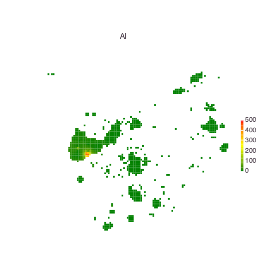
    


    

    


    pH: Min 1.0 Max 11.7 StdDev 0.55800503 Skewness -0.5521828 Count 9261
    TDS: Min 0.0 Max 329000.0 StdDev 34939.605 Skewness 7.7629066 Count 1740


    ┌ Info: TDS
    └ @ NMFk /Users/vvv/.julia/dev/NMFk/src/NMFkPreprocess.jl:54
    ┌ Info: Al
    └ @ NMFk /Users/vvv/.julia/dev/NMFk/src/NMFkPreprocess.jl:54


    
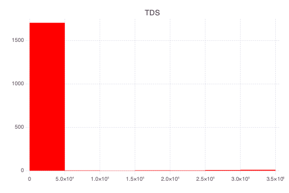
    


    

    


    Al: Min 0.0 Max 6400.0 StdDev 175.44391 Skewness 35.600906 Count 1362
    B: Min 0.0 Max 590.0 StdDev 19.017153 Skewness 19.091574 Count 5462


    ┌ Info: B
    └ @ NMFk /Users/vvv/.julia/dev/NMFk/src/NMFkPreprocess.jl:54
    ┌ Info: Ba
    └ @ NMFk /Users/vvv/.julia/dev/NMFk/src/NMFkPreprocess.jl:54


    

    


    
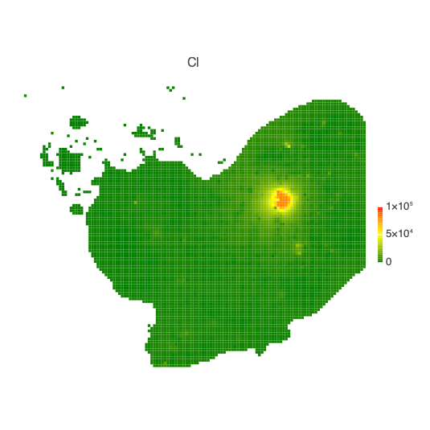
    


    
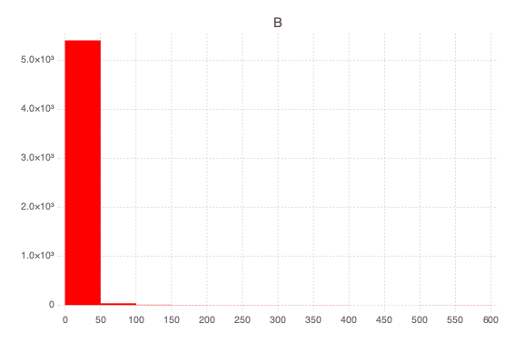
    


    Ba: Min 0.0 Max 27.430857 StdDev 0.58066297 Skewness 41.943157 Count 2516
    Be: Min 0.0 Max 0.7 StdDev 0.020862982 Skewness 26.046818 Count 1640
    Br: Min 0.0 Max 84.0 StdDev 7.721104 Skewness 5.398518 Count 1935


    ┌ Info: Be
    └ @ NMFk /Users/vvv/.julia/dev/NMFk/src/NMFkPreprocess.jl:54
    ┌ Info: Br
    └ @ NMFk /Users/vvv/.julia/dev/NMFk/src/NMFkPreprocess.jl:54
    ┌ Info: Ca
    └ @ NMFk /Users/vvv/.julia/dev/NMFk/src/NMFkPreprocess.jl:54


    

    


    

    


    

    


    Ca: Min 0.0 Max 2566.6667 StdDev 191.38284 Skewness 5.880362 Count 9468
    Cl: Min 0.0 Max 240000.0 StdDev 19115.326 Skewness 8.088112 Count 10091
    HCO3: Min 0.0 Max 37000.0 StdDev 740.00256 Skewness 37.66232 Count 3413


    ┌ Info: Cl
    └ @ NMFk /Users/vvv/.julia/dev/NMFk/src/NMFkPreprocess.jl:54
    ┌ Info: HCO3
    └ @ NMFk /Users/vvv/.julia/dev/NMFk/src/NMFkPreprocess.jl:54
    ┌ Info: K
    └ @ NMFk /Users/vvv/.julia/dev/NMFk/src/NMFkPreprocess.jl:54


    

    


    
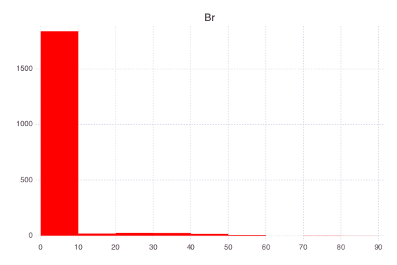
    


    K: Min 0.0 Max 13000.0 StdDev 692.70734 Skewness 9.866844 Count 8446
    Li: Min 0.0 Max 970.0 StdDev 41.178646 Skewness 15.181558 Count 2809


    ┌ Info: Li
    └ @ NMFk /Users/vvv/.julia/dev/NMFk/src/NMFkPreprocess.jl:54
    ┌ Info: Mg
    └ @ NMFk /Users/vvv/.julia/dev/NMFk/src/NMFkPreprocess.jl:54


    

    


    
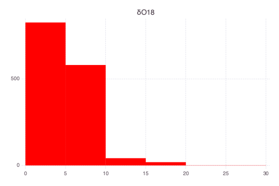
    


    Mg: Min 0.0 Max 8500.0 StdDev 454.54953 Skewness 9.703973 Count 9296
    Na: Min 0.0 Max 160000.0 StdDev 12159.811 Skewness 7.597518 Count 8814
    δO18: Min 0.79999924 Max 27.85 StdDev 2.772077 Skewness 2.0067368 Count 1471
    Name Min Max StdDev Count (non-NaN's)
    Temperature 0.1 275.0 25.12217 4.087667 13894
    Quartz -50.870045 273.2438 34.105637 0.6946969 8683
    Chalcedony -81.64773 271.23828 36.418324 0.8679946 8683
    pH 1.0 11.7 0.55800503 -0.5521828 9261
    TDS 0.0 329000.0 34939.605 7.7629066 1740
    Al 0.0 6400.0 175.44391 35.600906 1362
    B 0.0 590.0 19.017153 19.091574 5462
    Ba 0.0 27.430857 0.58066297 41.943157 2516
    Be 0.0 0.7 0.020862982 26.046818 1640
    Br 0.0 84.0 7.721104 5.398518 1935
    Ca 0.0 2566.6667 191.38284 5.880362 9468
    Cl 0.0 240000.0 19115.326 8.088112 10091
    HCO3 0.0 37000.0 740.00256 37.66232 3413
    K 0.0 13000.0 692.70734 9.866844 8446
    Li 0.0 970.0 41.178646 15.181558 2809
    Mg 0.0 8500.0 454.54953 9.703973 9296
    Na 0.0 160000.0 12159.811 7.597518 8814
    δO18 0.79999924 27.85 2.772077 2.0067368 1471


    ┌ Info: Na
    └ @ NMFk /Users/vvv/.julia/dev/NMFk/src/NMFkPreprocess.jl:54
    ┌ Info: δO18
    └ @ NMFk /Users/vvv/.julia/dev/NMFk/src/NMFkPreprocess.jl:54
    ┌ Info: Attributes
    └ @ NMFk /Users/vvv/.julia/dev/NMFk/src/NMFkPreprocess.jl:70


It is important to note that a lot of the attribute data are missing.


Close to complete records are available only for `Temperature`.

Data for `TDS`, `Al` and `δO18` are heavily missing.

Even though, the dataset is very sparse, our ML methods can analyze the inputs.

Most of the commonly used ML methods cannot process datasets that are sparse.

### Log-transformation

Attribute values are log-transformed to better capture the order of magnitude variability.

All attributes execpt for `Quartz`, `Chalcedony` and `pH` are log-transformed.


```julia
logv = [true, false, false, false,  true, true, true, true, true, true, true, true, true, true, true, true, true, true]
[attributes logv]
```


    18×2 Array{Any,2}:
     "Temperature"   true
     "Quartz"       false
     "Chalcedony"   false
     "pH"           false
     "TDS"           true
     "Al"            true
     "B"             true
     "Ba"            true
     "Be"            true
     "Br"            true
     "Ca"            true
     "Cl"            true
     "HCO3"          true
     "K"             true
     "Li"            true
     "Mg"            true
     "Na"            true
     "δO18"          true


```julia
NMFk.datanalytics(X, attributes; dims=2, logv=logv);
```


    
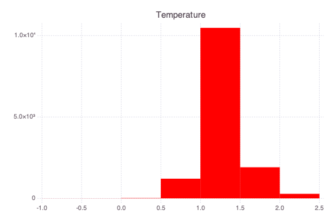
    


    ┌ Info: Temperature: log10-transformed
    └ @ NMFk /Users/vvv/.julia/dev/NMFk/src/NMFkPreprocess.jl:51


    

    


    

    


    Temperature: Min -1.0 Max 2.4393327 StdDev 0.28062904 Skewness 0.8823397 Count 13894
    Quartz: Min -50.870045 Max 273.2438 StdDev 34.105637 Skewness 0.6946969 Count 8683


    ┌ Info: Quartz
    └ @ NMFk /Users/vvv/.julia/dev/NMFk/src/NMFkPreprocess.jl:54
    ┌ Info: Chalcedony
    └ @ NMFk /Users/vvv/.julia/dev/NMFk/src/NMFkPreprocess.jl:54


    

    


    
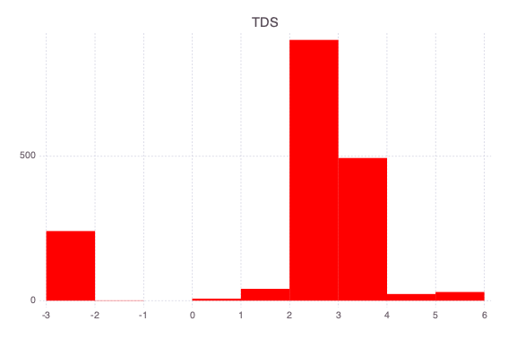
    


    Chalcedony: Min -81.64773 Max 271.23828 StdDev 36.418324 Skewness 0.8679946 Count 8683
    pH: Min 1.0 Max 11.7 StdDev 0.55800503 Skewness -0.5521828 Count 9261


    ┌ Info: pH
    └ @ NMFk /Users/vvv/.julia/dev/NMFk/src/NMFkPreprocess.jl:54
    ┌ Info: TDS: log10-transformed
    └ @ NMFk /Users/vvv/.julia/dev/NMFk/src/NMFkPreprocess.jl:51


    
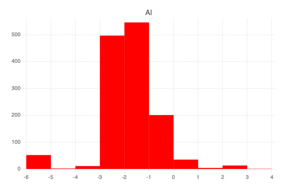
    


    
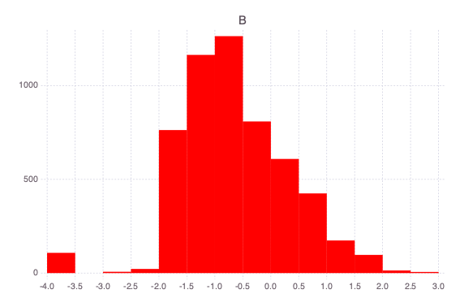
    


    TDS: Min -2.6989698 Max 5.5171957 StdDev 2.0129914 Skewness -1.7111415 Count 1740
    Al: Min -5.8860564 Max 3.80618 StdDev 1.2161667 Skewness -0.44271475 Count 1362


    ┌ Info: Al: log10-transformed
    └ @ NMFk /Users/vvv/.julia/dev/NMFk/src/NMFkPreprocess.jl:51
    ┌ Info: B: log10-transformed
    └ @ NMFk /Users/vvv/.julia/dev/NMFk/src/NMFkPreprocess.jl:51


    

    


    B: Min -4.0 Max 2.770852 StdDev 0.99189556 Skewness -0.15991572 Count 5462


    ┌ Info: Ba: log10-transformed
    └ @ NMFk /Users/vvv/.julia/dev/NMFk/src/NMFkPreprocess.jl:51


    

    


    

    


    Ba: Min -4.0 Max 1.4382393 StdDev 0.492002 Skewness -0.63361335 Count 2516
    Be: Min -8.0 Max -0.15490197 StdDev 0.8196359 Skewness -2.5543597 Count 1640


    ┌ Info: Be: log10-transformed
    └ @ NMFk /Users/vvv/.julia/dev/NMFk/src/NMFkPreprocess.jl:51
    ┌ Info: Br: log10-transformed
    └ @ NMFk /Users/vvv/.julia/dev/NMFk/src/NMFkPreprocess.jl:51


    
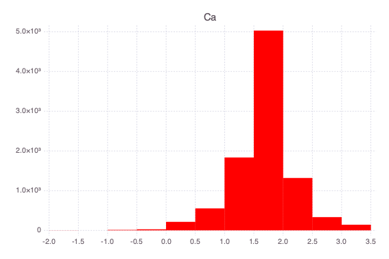
    


    Br: Min -3.102373 Max 1.9242793 StdDev 0.90064573 Skewness 0.497394 Count 1935


    ┌ Info: Ca: log10-transformed
    └ @ NMFk /Users/vvv/.julia/dev/NMFk/src/NMFkPreprocess.jl:51


    

    


    

    


    Ca: Min -2.0 Max 3.4093695 StdDev 0.51392627 Skewness -0.4936186 Count 9468
    Cl: Min -4.0 Max 5.3802114 StdDev 0.99255455 Skewness 0.45536557 Count 10091


    ┌ Info: Cl: log10-transformed
    └ @ NMFk /Users/vvv/.julia/dev/NMFk/src/NMFkPreprocess.jl:51
    ┌ Info: HCO3: log10-transformed
    └ @ NMFk /Users/vvv/.julia/dev/NMFk/src/NMFkPreprocess.jl:51


    
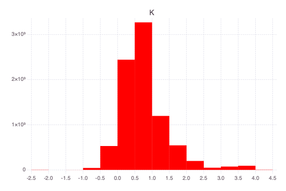
    


    HCO3: Min -1.0 Max 4.5682015 StdDev 0.36140293 Skewness -0.94632554 Count 3413


    ┌ Info: K: log10-transformed
    └ @ NMFk /Users/vvv/.julia/dev/NMFk/src/NMFkPreprocess.jl:51


    

    


    K: Min -2.09691 Max 4.1139436 StdDev 0.686127 Skewness 1.5732428 Count 8446


    ┌ Info: Li: log10-transformed
    └ @ NMFk /Users/vvv/.julia/dev/NMFk/src/NMFkPreprocess.jl:51


    

    


    
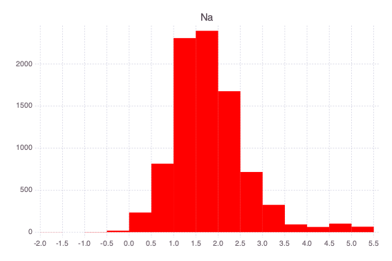
    


    Li: Min -6.0 Max 2.9867718 StdDev 1.2346249 Skewness -0.6840743 Count 2809
    Mg: Min -3.69897 Max 3.929419 StdDev 0.79547274 Skewness -1.0883808 Count 9296


    ┌ Info: Mg: log10-transformed
    └ @ NMFk /Users/vvv/.julia/dev/NMFk/src/NMFkPreprocess.jl:51
    ┌ Info: Na: log10-transformed
    └ @ NMFk /Users/vvv/.julia/dev/NMFk/src/NMFkPreprocess.jl:51


    

    


    Na: Min -1.6989701 Max 5.20412 StdDev 0.8328025 Skewness 1.1553397 Count 8814
    δO18: Min -0.096910425 Max 1.4448252 StdDev 0.20046535 Skewness 0.21996279 Count 1471
    Name Min Max StdDev Count (non-NaN's)
    Temperature -1.0 2.4393327 0.28062904 0.8823397 13894
    Quartz -50.870045 273.2438 34.105637 0.6946969 8683
    Chalcedony -81.64773 271.23828 36.418324 0.8679946 8683
    pH 1.0 11.7 0.55800503 -0.5521828 9261
    TDS -2.6989698 5.5171957 2.0129914 -1.7111415 1740
    Al -5.8860564 3.80618 1.2161667 -0.44271475 1362
    B -4.0 2.770852 0.99189556 -0.15991572 5462
    Ba -4.0 1.4382393 0.492002 -0.63361335 2516
    Be -8.0 -0.15490197 0.8196359 -2.5543597 1640
    Br -3.102373 1.9242793 0.90064573 0.497394 1935
    Ca -2.0 3.4093695 0.51392627 -0.4936186 9468
    Cl -4.0 5.3802114 0.99255455 0.45536557 10091
    HCO3 -1.0 4.5682015 0.36140293 -0.94632554 3413
    K -2.09691 4.1139436 0.686127 1.5732428 8446
    Li -6.0 2.9867718 1.2346249 -0.6840743 2809
    Mg -3.69897 3.929419 0.79547274 -1.0883808 9296
    Na -1.6989701 5.20412 0.8328025 1.1553397 8814
    δO18 -0.096910425 1.4448252 0.20046535 0.21996279 1471


    ┌ Info: δO18: log10-transformed
    └ @ NMFk /Users/vvv/.julia/dev/NMFk/src/NMFkPreprocess.jl:51
    ┌ Info: Attributes
    └ @ NMFk /Users/vvv/.julia/dev/NMFk/src/NMFkPreprocess.jl:70


#### Define and normalize the data matrix


```julia
Xnl, xlmin, xlmax, zflag = NMFk.normalizematrix_col(X; logv=logv);
```

### Define a range for number of signatures to be explored 


```julia
nkrange = 2:10;
```

### Define directory with exsiting model runs


```julia
resultdir = "results";
```

#### Define the number of NMF runs to be exectuted

The higher the NMF runs, the better.
In addition, convergence has been already explored using different numbers of NMF runs.


```julia
nruns = 640;
```

## Perform ML analyses

The **NMFk** algorithm factorizes the normalized data matrix `Xn` into `W` and `H` matrices.
For more information, check out the [**NMFk** website](https://github.com/SmartTensors/NMFk.jl)


```julia
W, H, fitquality, robustness, aic = NMFk.execute(Xnl, nkrange, nruns; resultdir=resultdir, casefilename="nmfk-nl", load=true)
W, H, fitquality, robustness, aic = NMFk.load(nkrange, nruns; resultdir=resultdir, casefilename="nmfk-nl");
```

    Signals:  2 Fit:     490.2203 Silhouette:     0.886031 AIC:    -531856.6
    Signals:  3 Fit:     315.1114 Silhouette:     0.498339 AIC:    -551467.8
    Signals:  4 Fit:      224.617 Silhouette:  -0.01242121 AIC:    -559810.1
    Signals:  5 Fit:     157.1487 Silhouette:  0.004662591 AIC:    -570187.6
    Signals:  6 Fit:     118.4444 Silhouette:   -0.1862046 AIC:    -572450.7
    Signals:  7 Fit:      85.8435 Silhouette:  -0.09372894 AIC:    -578982.6
    Signals:  8 Fit:      62.9881 Silhouette:    -0.113508 AIC:    -584169.8
    Signals:  9 Fit:     45.59955 Silhouette:  -0.05323793 AIC:    -590824.9
    Signals: 10 Fit:     33.40136 Silhouette:  -0.08453866 AIC:    -596199.8
    Signals:  2 Fit:     490.2203 Silhouette:     0.886031 AIC:    -531856.6
    Signals:  3 Fit:     315.1114 Silhouette:     0.498339 AIC:    -551467.8
    Signals:  4 Fit:      224.617 Silhouette:  -0.01242121 AIC:    -559810.1
    Signals:  5 Fit:     157.1487 Silhouette:  0.004662591 AIC:    -570187.6
    Signals:  6 Fit:     118.4444 Silhouette:   -0.1862046 AIC:    -572450.7
    Signals:  7 Fit:      85.8435 Silhouette:  -0.09372894 AIC:    -578982.6
    Signals:  8 Fit:      62.9881 Silhouette:    -0.113508 AIC:    -584169.8
    Signals:  9 Fit:     45.59955 Silhouette:  -0.05323793 AIC:    -590824.9
    Signals: 10 Fit:     33.40136 Silhouette:  -0.08453866 AIC:    -596199.8
    Signals:  2 Fit:     490.2203 Silhouette:     0.886031 AIC:    -531856.6
    Signals:  3 Fit:     315.1114 Silhouette:     0.498339 AIC:    -551467.8
    Signals:  4 Fit:      224.617 Silhouette:  -0.01242121 AIC:    -559810.1
    Signals:  5 Fit:     157.1487 Silhouette:  0.004662591 AIC:    -570187.6
    Signals:  6 Fit:     118.4444 Silhouette:   -0.1862046 AIC:    -572450.7
    Signals:  7 Fit:      85.8435 Silhouette:  -0.09372894 AIC:    -578982.6
    Signals:  8 Fit:      62.9881 Silhouette:    -0.113508 AIC:    -584169.8
    Signals:  9 Fit:     45.59955 Silhouette:  -0.05323793 AIC:    -590824.9
    Signals: 10 Fit:     33.40136 Silhouette:  -0.08453866 AIC:    -596199.8


    ┌ Info: Results
    └ @ NMFk /Users/vvv/.julia/dev/NMFk/src/NMFkExecute.jl:15
    ┌ Info: Optimal solution: 3 signals
    └ @ NMFk /Users/vvv/.julia/dev/NMFk/src/NMFkExecute.jl:20
    ┌ Info: Optimal solution: 3 signals
    └ @ NMFk /Users/vvv/.julia/dev/NMFk/src/NMFkIO.jl:30


Here, the **NMFk** results are loaded from a prior ML run.

As seen from the output above, the NMFk analyses identified that the optimal number of geothermal signatures in the dataset **3**.

Solutions with a number of signatures less than **3** are underfitting.

Solutions with a number of signatures greater than **3** are overfitting and unacceptable.

The set of acceptable solutions are defined as follows:


```julia
NMFk.getks(nkrange, robustness[nkrange])
```


    2-element Array{Int64,1}:
     2
     3


The acceptable solutions contain 2 and 3 signatures.

### Post-processing NMFk results

#### Number of signatures

Plot representing solution quality (fit) and silhouette width (robustness) for different number of signatures `k`:


```julia
resultdirpost = "results-postprocessing-nl-$(nruns)"
figuredirpost = "figures-postprocessing-nl-$(nruns)";
```


```julia
NMFk.plot_feature_selecton(nkrange, fitquality, robustness; figuredir=figuredirpost)
```


    
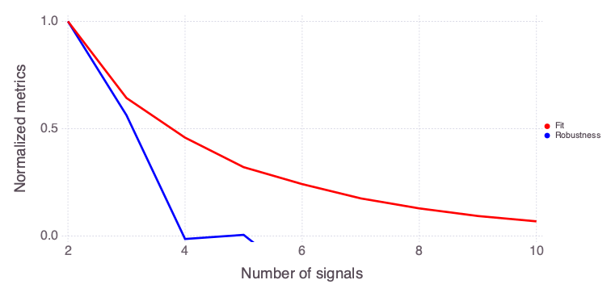
    


    

The plot above also demonstrates that the accceptable solutions contain 2 and 3 signatures.
Note, any solution is accepted, if the robustness >0.25.

#### Analysis of the optimal solution

The ML solution with the optimal number of signatures (3) is further analyzed as follows:


```julia
Sorder, Wclusters, Hclusters = NMFk.clusterresults(NMFk.getk(nkrange, robustness[nkrange]), W, H, string.(collect(1:npoints)), attributes; lon=xcoord, lat=ycoord, resultdir=resultdirpost, figuredir=figuredirpost, ordersignal=:Wcount, Hcasefilename="attributes", Wcasefilename="locations", biplotcolor=:WH, sortmag=false, biplotlabel=:H, point_size_nolabel=2Gadfly.pt, point_size_label=4Gadfly.pt)
```

    Signal importance (high->low): [2, 1, 3]


    ┌ Info: Number of signals: 3
    └ @ NMFk /Users/vvv/.julia/dev/NMFk/src/NMFkPostprocess.jl:154
    ┌ Info: Attributes (signals=3)
    └ @ NMFk /Users/vvv/.julia/dev/NMFk/src/NMFkPostprocess.jl:158
    ┌ Warning: type Clustering.KmeansResult{Core.Array{Core.Float32,2},Core.Float32,Core.Int64} not present in workspace; reconstructing
    └ @ JLD /Users/vvv/.julia/packages/JLD/nQ9iW/src/jld_types.jl:697
    ┌ Info: Robust k-means analysis results are loaded from file results-postprocessing-nl-640/Hmatrix-3-3_18-1000.jld!
    └ @ NMFk /Users/vvv/.julia/dev/NMFk/src/NMFkCluster.jl:67
    ┌ Warning: Procedure to find unique signals could not identify a solution ...
    └ @ NMFk /Users/vvv/.julia/dev/NMFk/src/NMFkCluster.jl:158
    ┌ Warning: Procedure to find unique signals could not identify a solution ...
    └ @ NMFk /Users/vvv/.julia/dev/NMFk/src/NMFkCluster.jl:158
    ┌ Warning: Procedure to find unique signals could not identify a solution ...
    └ @ NMFk /Users/vvv/.julia/dev/NMFk/src/NMFkCluster.jl:158
    ┌ Warning: type Clustering.KmeansResult{Core.Array{Core.Float32,2},Core.Float32,Core.Int64} not present in workspace; reconstructing
    └ @ JLD /Users/vvv/.julia/packages/JLD/nQ9iW/src/jld_types.jl:697
    ┌ Info: Robust k-means analysis results are loaded from file results-postprocessing-nl-640/Wmatrix-3-3_14258-1000.jld!
    └ @ NMFk /Users/vvv/.julia/dev/NMFk/src/NMFkCluster.jl:67
    ┌ Warning: Procedure to find unique signals could not identify a solution ...
    └ @ NMFk /Users/vvv/.julia/dev/NMFk/src/NMFkCluster.jl:158
    ┌ Warning: Procedure to find unique signals could not identify a solution ...
    └ @ NMFk /Users/vvv/.julia/dev/NMFk/src/NMFkCluster.jl:158


    8×2 Array{Any,2}:
     "Br"    1.0
     "TDS"   0.998519
     "B"     0.761876
     "δO18"  0.63782
     "Na"    0.548602
     "Li"    0.463867
     "Cl"    0.457713
     "K"     0.427433


    ┌ Info: Signal A -> A Count: 8
    └ @ NMFk /Users/vvv/.julia/dev/NMFk/src/NMFkPostprocess.jl:265
    ┌ Info: Signal C -> B Count: 3
    └ @ NMFk /Users/vvv/.julia/dev/NMFk/src/NMFkPostprocess.jl:265
    ┌ Info: Signal B -> C Count: 7
    └ @ NMFk /Users/vvv/.julia/dev/NMFk/src/NMFkPostprocess.jl:265
    ┌ Info: Signal A (S3) (k-means clustering)
    └ @ NMFk /Users/vvv/.julia/dev/NMFk/src/NMFkPostprocess.jl:282


    3×2 Array{Any,2}:
     "Quartz"      1.0
     "Chalcedony"  0.945545
     "Al"          0.802297


    7×2 Array{Any,2}:
     "Mg"           1.0
     "Ca"           0.935713
     "HCO3"         0.679563
     "pH"           0.651626
     "Ba"           0.622107
     "Be"           0.578012
     "Temperature"  0.464707


    

    


    ┌ Info: Signal B (S1) (k-means clustering)
    └ @ NMFk /Users/vvv/.julia/dev/NMFk/src/NMFkPostprocess.jl:282
    ┌ Info: Signal C (S2) (k-means clustering)
    └ @ NMFk /Users/vvv/.julia/dev/NMFk/src/NMFkPostprocess.jl:282


    

    


    


    
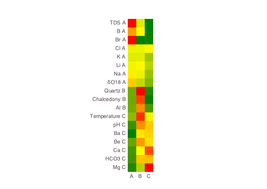
    


    
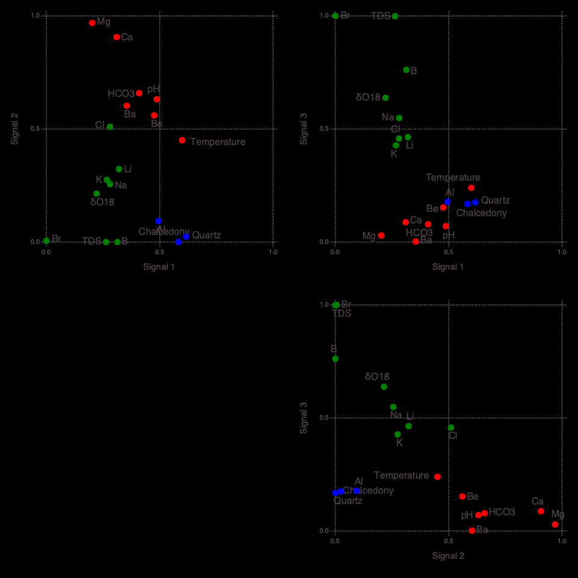
    


    


    
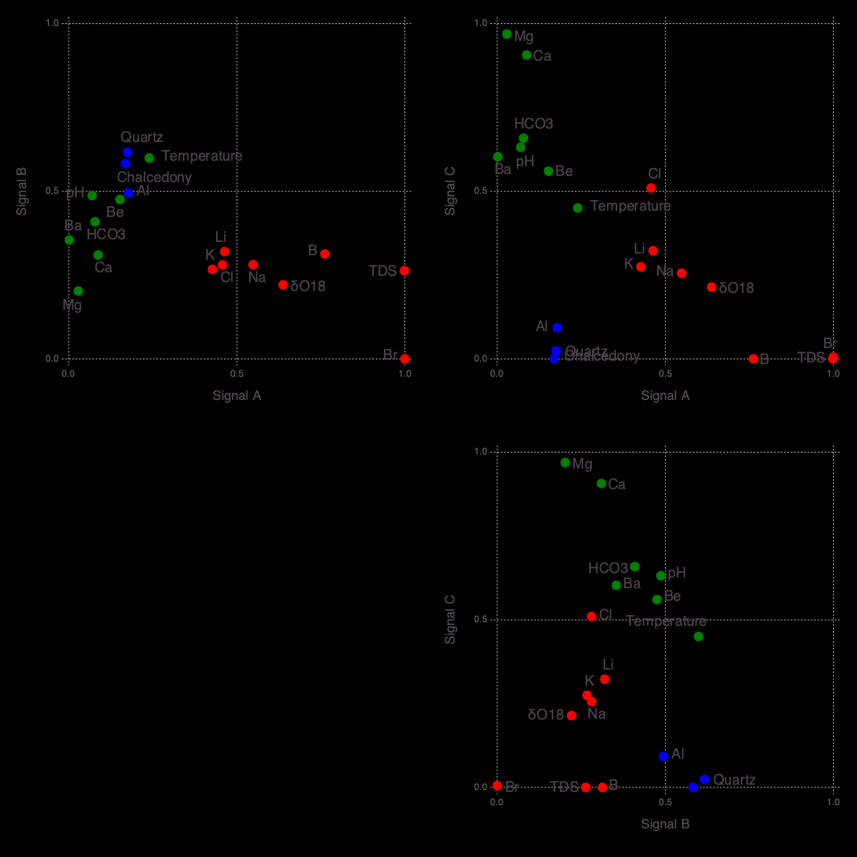
    


    


    6256×2 Array{Any,2}:
     "8740"   1.0
     "4307"   0.973089
     "13597"  0.926034
     "6745"   0.920183
     "6743"   0.915929
     "6995"   0.892192
     "6902"   0.88208
     "7159"   0.880767
     "7013"   0.879407
     "6947"   0.87884
     "6998"   0.877846
     "7000"   0.875902
     "6985"   0.874451
     ⋮        
     "13228"  0.0
     "13282"  0.0
     "13373"  0.0
     "13389"  0.0
     "13397"  0.0
     "13434"  0.0
     "13439"  0.0
     "13441"  0.0
     "13456"  0.0
     "13460"  0.0
     "13517"  0.0
     "13882"  0.0


    5201×2 Array{Any,2}:
     "3910"   1.0
     "10796"  0.839622
     "10799"  0.839453
     "10784"  0.836072
     "10797"  0.833352
     "10786"  0.829575
     "10800"  0.825416
     "10785"  0.817501
     "12799"  0.810014
     "10883"  0.795935
     "10882"  0.785195
     "10877"  0.784725
     "10876"  0.78121
     ⋮        
     "903"    0.243983
     "10531"  0.243834
     "983"    0.243368
     "3502"   0.241069
     "108"    0.240825
     "12996"  0.240369
     "1819"   0.240354
     "487"    0.233168
     "514"    0.225323
     "14122"  0.225207
     "3356"   0.221252
     "7392"   0.215268


    ┌ Info: Locations (signals=3)
    └ @ NMFk /Users/vvv/.julia/dev/NMFk/src/NMFkPostprocess.jl:340
    ┌ Info: Signal A (S3) Count: 6256
    └ @ NMFk /Users/vvv/.julia/dev/NMFk/src/NMFkPostprocess.jl:353
    ┌ Info: Signal B (S1) Count: 5201
    └ @ NMFk /Users/vvv/.julia/dev/NMFk/src/NMFkPostprocess.jl:353
    ┌ Info: Signal C (S2) Count: 2801
    └ @ NMFk /Users/vvv/.julia/dev/NMFk/src/NMFkPostprocess.jl:353
    ┌ Info: Signal A -> A Count: 6256
    └ @ NMFk /Users/vvv/.julia/dev/NMFk/src/NMFkPostprocess.jl:363
    ┌ Info: Signal B -> B Count: 5201
    └ @ NMFk /Users/vvv/.julia/dev/NMFk/src/NMFkPostprocess.jl:363
    ┌ Info: Signal C -> C Count: 2801
    └ @ NMFk /Users/vvv/.julia/dev/NMFk/src/NMFkPostprocess.jl:363
    ┌ Info: Signal A (remapped k-means clustering)
    └ @ NMFk /Users/vvv/.julia/dev/NMFk/src/NMFkPostprocess.jl:378
    ┌ Info: Signal B (remapped k-means clustering)
    └ @ NMFk /Users/vvv/.julia/dev/NMFk/src/NMFkPostprocess.jl:378
    ┌ Info: Signal C (remapped k-means clustering)
    └ @ NMFk /Users/vvv/.julia/dev/NMFk/src/NMFkPostprocess.jl:378


    2801×2 Array{Any,2}:
     "11813"  1.0
     "12933"  0.995532
     "10102"  0.985685
     "7816"   0.979038
     "11102"  0.976738
     "11533"  0.967216
     "12897"  0.960254
     "11808"  0.95469
     "10483"  0.949177
     "9907"   0.944174
     "12909"  0.941319
     "11535"  0.939949
     "11817"  0.939765
     ⋮        
     "9942"   0.272538
     "14153"  0.27231
     "2717"   0.270224
     "7956"   0.268112
     "233"    0.264453
     "3219"   0.263445
     "484"    0.255068
     "16"     0.253433
     "8652"   0.233033
     "499"    0.229715
     "7334"   0.224784
     "470"    0.181262


    

    


    

    


    


    
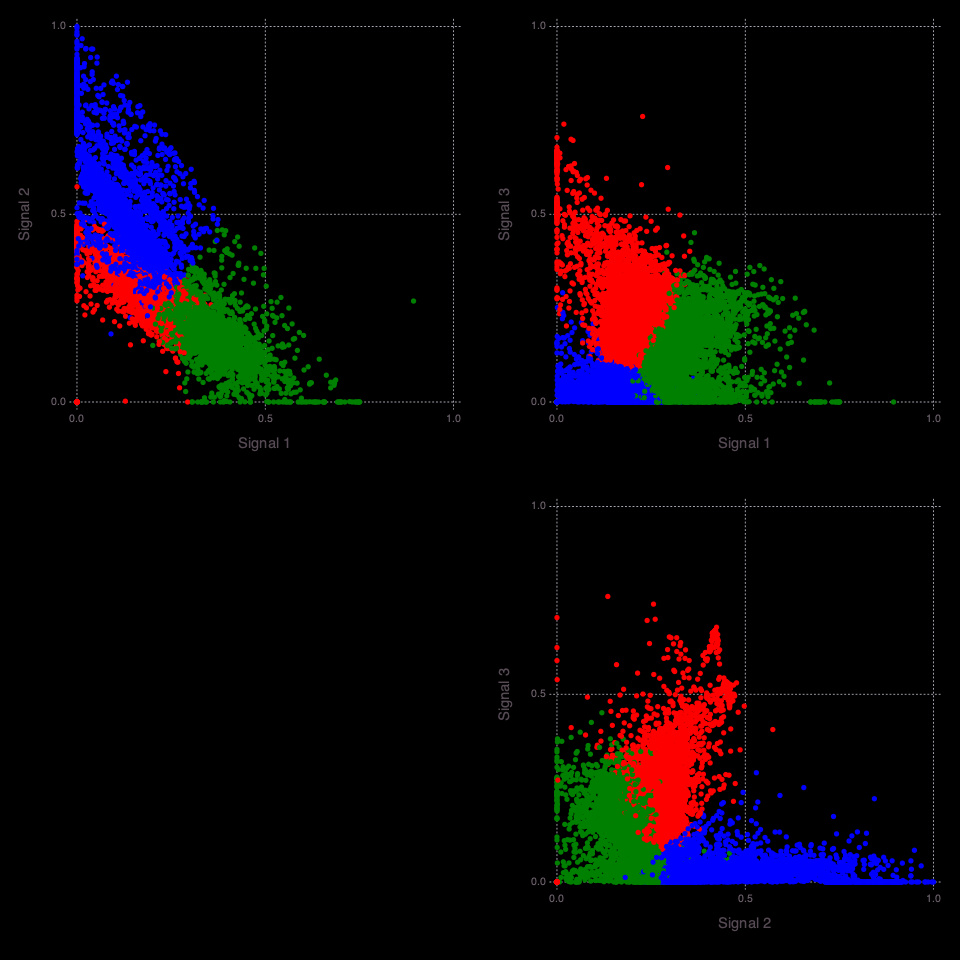
    


    ArgumentError("Distance matrix should be symmetric.")


    ┌ Warning: Dendogram ploting failed!
    └ @ NMFk /Users/vvv/.julia/dev/NMFk/src/NMFkPostprocess.jl:431


    

    


    


    
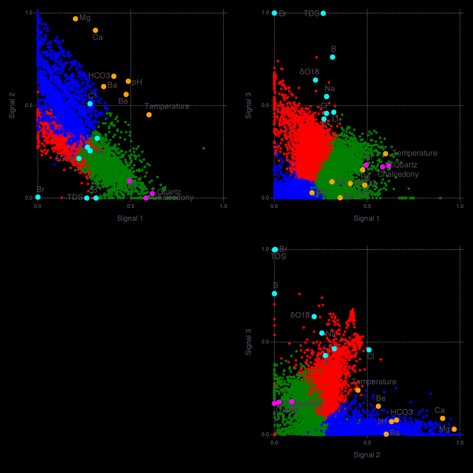
    


    
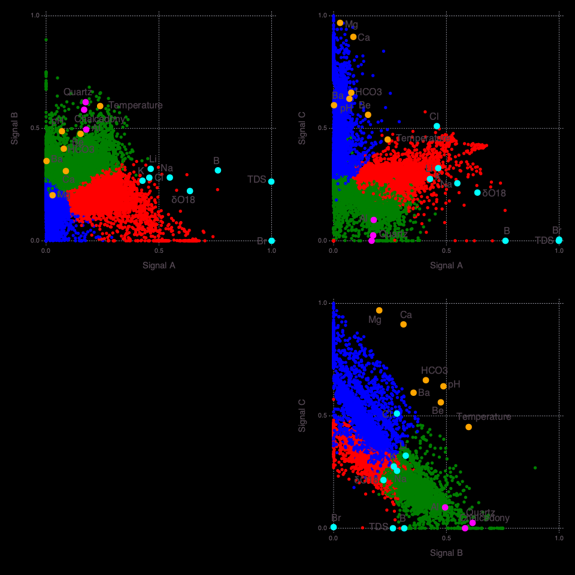
    


    


    ([[3, 1, 2]], [['A', 'A', 'A', 'A', 'C', 'A', 'A', 'A', 'C', 'B'  …  'A', 'A', 'B', 'A', 'A', 'B', 'A', 'B', 'B', 'A']], [['C', 'B', 'B', 'C', 'A', 'B', 'A', 'C', 'C', 'A', 'C', 'A', 'C', 'A', 'A', 'C', 'A', 'A']])


The geothermal attributes are clustered into **3** groups:

<div style="background-color: gray;">
    <iframe src="../results-postprocessing-nl-640/attributes-3-groups.txt" frameborder="0" height="400"
      width="95%"></iframe>
</div>

This grouping is based on analyses of the attribute matrix `W`:

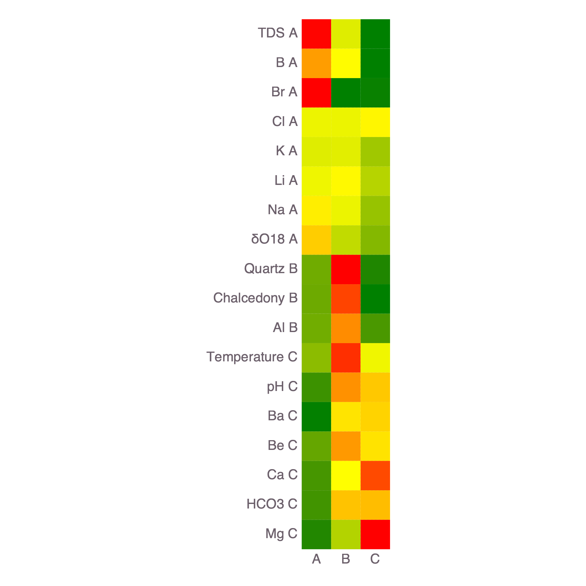

The well locations are also clustered into **3** groups.
The grouping is based on analyses of the location matrix `H`.

A spatial map of the locations is obtained:


The map [../figures-postprocessing-nl-640/locations-3-map.html](../figures-postprocessing-nl-640/locations-3-map.html) provides interactive visualization of the extracted location groups (the html file can be also openned with any browser). 

<div>
    <iframe src="../figures-postprocessing-nl-640/locations-3-map.html" frameborder="0" height="800" width="50%"></iframe>
</div>


### Discussion of NMFk results

Our ML algorithm extracted **3** signatures in the analyzed dataset.

Signature **B** is detected at 5201 locations shown in the map above.

At these locations, `Temperature`, `Quartz`, `Chalcedony` and `Al` appear to be elevated.
There is general correlations between `Temperature`, `Quartz`, `Chalcedony` and `Al` observations at these locations.
All these locations can be identified as geothermal resources with high prospectivity.

Signature **C** is detected at 2801 locations shown in the map above.

At these locations, `Temperature` is also elevated. However, `Quartz`, `Chalcedony` and `Al` are low.
However, `Ca` and `Mg` are elevated as well.
All these locations can be identified as geothermal resources with lower prospectivity.
Additional analyses and data acquisition activities are needed to define their prospectivity.

Signature **A** is detected at 6256 locations shown in the map above.

At these locations, `TDS`, `B` and `Br` are elevated.
However, the `Temperature` is low.
These locations can be identified as geothermal resources with low prospectivity.

Biplots are also generated by the scripts presented above to map the interelations between the attributes as defined by the extraced **3** signatures which can be viewed also as basis vectors.
The interpretation of the biplots is consistent with the way eigen-analysis (SVD/PCA) biplots are also interpreted.


It clear from the figure above, that `Temperature`, `Quartz`, `Chalcedony` and `Al` are generally collocated.

`Ca` and `Mg` are also collocated.

Similarly, `K`, `Li` and `Na` are also collocated.

The coloring of the dots represents the ML clustering of the attributes into **3** groups.

The figure demonstrates that ML algorithm successfully identified attributes which have generally similar spatial patterns.

The biplots can also map the locations at which the data are collected as shown in the figure below.


The coloring of the dots represents the ML clustering of the attributes and locations into **3** groups each (**6** groups in total).

The biplots above show how the attribute data is applied to label the locations so that they are optimally grouped into **3** locations clusters.
